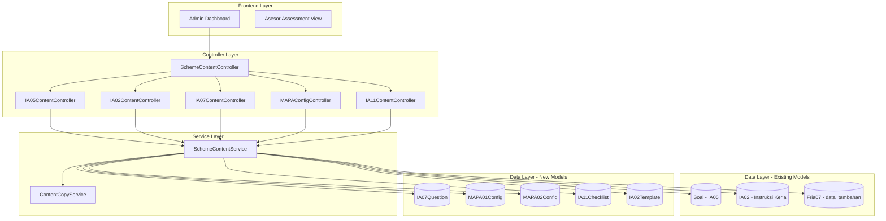
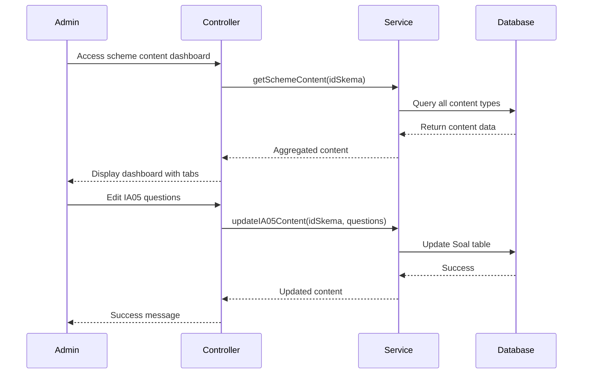
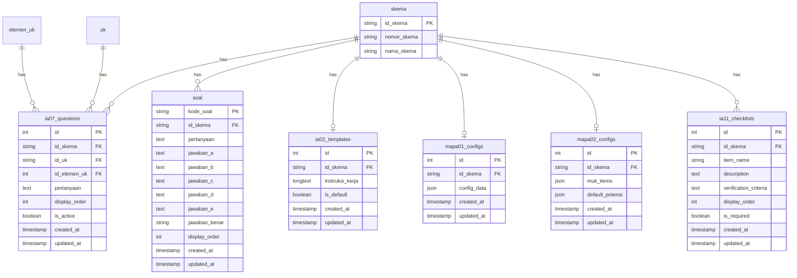

# Design Document: Manajemen Konten Asesmen per Template IA

## Overview

Fitur ini menyediakan manajemen konten asesmen yang terintegrasi dengan template masing-masing jenis IA per skema. Sistem akan memanfaatkan model-model yang sudah ada (Soal, IA02, Fria07, dll) dan menambahkan model baru untuk konten yang belum ada. Admin dapat mengelola konten spesifik per skema melalui dashboard terpadu dengan tabs untuk setiap jenis IA.

## Architecture

### High-Level Architecture



### Content Flow



## Components and Interfaces

### 1. Models

#### Existing Models (To Be Used)

**Soal Model** - Already exists for IA05 multiple choice questions
```php
// Already has: kode_soal, id_skema, pertanyaan, jawaban_a-e, jawaban_benar
// Will add: display_order column
```

**IA02 Model** - Already exists for work instructions
```php
// Already has: instruksi_kerja field
// Will add: IA02Template model for scheme-level templates
```

**Fria07 Model** - Already exists with data_tambahan JSON
```php
// data_tambahan contains unit_kompetensi with questions
// Will add: IA07Question model for scheme-level question templates
```

#### New Models

**IA07Question Model**
```php
class IA07Question extends Model
{
    protected $table = 'ia07_questions';
    protected $fillable = [
        'id_skema',
        'id_uk',
        'id_elemen_uk',
        'pertanyaan',
        'display_order',
        'is_active'
    ];
    
    public function skema(): BelongsTo;
    public function unitKompetensi(): BelongsTo;
    public function elemenUK(): BelongsTo;
}
```

**IA02Template Model**
```php
class IA02Template extends Model
{
    protected $table = 'ia02_templates';
    protected $fillable = [
        'id_skema',
        'instruksi_kerja',
        'is_default'
    ];
    
    public function skema(): BelongsTo;
}
```

**MAPA01Config Model**
```php
class MAPA01Config extends Model
{
    protected $table = 'mapa01_configs';
    protected $fillable = [
        'id_skema',
        'config_data' // JSON: pendekatan_asesmen defaults
    ];
    
    protected $casts = ['config_data' => 'array'];
    
    public function skema(): BelongsTo;
}
```

**MAPA02Config Model**
```php
class MAPA02Config extends Model
{
    protected $table = 'mapa02_configs';
    protected $fillable = [
        'id_skema',
        'muk_items', // JSON: enabled MUK items
        'default_potensi' // JSON: default potensi values
    ];
    
    protected $casts = [
        'muk_items' => 'array',
        'default_potensi' => 'array'
    ];
    
    public function skema(): BelongsTo;
}
```

**IA11Checklist Model**
```php
class IA11Checklist extends Model
{
    protected $table = 'ia11_checklists';
    protected $fillable = [
        'id_skema',
        'item_name',
        'description',
        'verification_criteria',
        'display_order',
        'is_required'
    ];
    
    public function skema(): BelongsTo;
}
```

### 2. Services

**SchemeContentService**
```php
interface SchemeContentServiceInterface
{
    // IA05 - Multiple Choice Questions
    public function getIA05Questions(string $idSkema): Collection;
    public function createIA05Question(string $idSkema, array $data): Soal;
    public function updateIA05Question(string $kodeSoal, array $data): bool;
    public function deleteIA05Question(string $kodeSoal): bool;
    public function reorderIA05Questions(string $idSkema, array $order): bool;
    
    // IA02 - Work Instructions
    public function getIA02Template(string $idSkema): ?IA02Template;
    public function saveIA02Template(string $idSkema, string $content): IA02Template;
    
    // IA07 - Oral Questions
    public function getIA07Questions(string $idSkema): Collection;
    public function createIA07Question(string $idSkema, array $data): IA07Question;
    public function updateIA07Question(int $id, array $data): bool;
    public function deleteIA07Question(int $id): bool;
    
    // MAPA01 - Assessment Planning Config
    public function getMAPA01Config(string $idSkema): ?MAPA01Config;
    public function saveMAPA01Config(string $idSkema, array $config): MAPA01Config;
    
    // MAPA02 - Assessment Instrument Config
    public function getMAPA02Config(string $idSkema): ?MAPA02Config;
    public function saveMAPA02Config(string $idSkema, array $config): MAPA02Config;
    
    // IA11 - Portfolio Checklist
    public function getIA11Checklist(string $idSkema): Collection;
    public function createIA11Item(string $idSkema, array $data): IA11Checklist;
    public function updateIA11Item(int $id, array $data): bool;
    public function deleteIA11Item(int $id): bool;
    
    // Dashboard
    public function getContentSummary(string $idSkema): array;
    public function hasContent(string $idSkema): bool;
}
```

**ContentCopyService**
```php
interface ContentCopyServiceInterface
{
    public function getSchemesWithContent(): Collection;
    public function copyAllContent(string $sourceSkema, string $targetSkema, bool $overwrite = false): array;
    public function copyIA05Content(string $sourceSkema, string $targetSkema): int;
    public function copyIA02Content(string $sourceSkema, string $targetSkema): bool;
    public function copyIA07Content(string $sourceSkema, string $targetSkema): int;
    public function copyMAPAConfig(string $sourceSkema, string $targetSkema): bool;
    public function copyIA11Content(string $sourceSkema, string $targetSkema): int;
}
```

### 3. Controllers

**SchemeContentController**
- `GET /admin/skema/{id}/content` - Dashboard with tabs
- `GET /admin/skema/{id}/content/summary` - Content summary API

**IA05ContentController**
- `GET /admin/skema/{id}/content/ia05` - List questions
- `POST /admin/skema/{id}/content/ia05` - Create question
- `PUT /admin/skema/{id}/content/ia05/{kode}` - Update question
- `DELETE /admin/skema/{id}/content/ia05/{kode}` - Delete question
- `POST /admin/skema/{id}/content/ia05/reorder` - Reorder questions

**IA02ContentController**
- `GET /admin/skema/{id}/content/ia02` - Get template
- `POST /admin/skema/{id}/content/ia02` - Save template

**IA07ContentController**
- `GET /admin/skema/{id}/content/ia07` - List questions by UK
- `POST /admin/skema/{id}/content/ia07` - Create question
- `PUT /admin/skema/{id}/content/ia07/{id}` - Update question
- `DELETE /admin/skema/{id}/content/ia07/{id}` - Delete question

**MAPAConfigController**
- `GET /admin/skema/{id}/content/mapa01` - Get MAPA01 config
- `POST /admin/skema/{id}/content/mapa01` - Save MAPA01 config
- `GET /admin/skema/{id}/content/mapa02` - Get MAPA02 config
- `POST /admin/skema/{id}/content/mapa02` - Save MAPA02 config

**IA11ContentController**
- `GET /admin/skema/{id}/content/ia11` - List checklist items
- `POST /admin/skema/{id}/content/ia11` - Create item
- `PUT /admin/skema/{id}/content/ia11/{id}` - Update item
- `DELETE /admin/skema/{id}/content/ia11/{id}` - Delete item

**ContentCopyController**
- `GET /admin/content/copy/sources` - Get schemes with content
- `POST /admin/content/copy` - Copy content between schemes

## Data Models

### Database Schema



### Migration for display_order on Soal table
```php
Schema::table('soal', function (Blueprint $table) {
    $table->integer('display_order')->default(0)->after('jawaban_benar');
});
```

## Correctness Properties

*A property is a characteristic or behavior that should hold true across all valid executions of a system-essentially, a formal statement about what the system should do. Properties serve as the bridge between human-readable specifications and machine-verifiable correctness guarantees.*

### Property 1: Scheme Content Isolation
*For any* scheme and any content type (IA05, IA02, IA07, IA11), content created for that scheme SHALL only be retrievable when querying that specific scheme.
**Validates: Requirements 1.1, 2.1, 3.1, 6.1**

### Property 2: IA05 Question Validation
*For any* multiple choice question creation, the system SHALL require question text, at least 2 non-empty answer options, and a valid correct answer marking.
**Validates: Requirements 1.2**

### Property 3: Content Edit Preserves Association
*For any* content item (question, checklist item, template) that is edited, the scheme association SHALL remain unchanged after the edit.
**Validates: Requirements 1.3, 3.3, 6.3**

### Property 4: Content Deletion Removes Item
*For any* content item that is deleted, the item SHALL no longer be retrievable from the database.
**Validates: Requirements 1.4, 3.4, 6.4**

### Property 5: Question Reorder Persistence
*For any* reorder operation on IA05 questions, the new display order SHALL be persisted and reflected in subsequent queries.
**Validates: Requirements 1.5**

### Property 6: IA02 Template Round Trip
*For any* IA02 template content saved, retrieving the template SHALL return content equivalent to what was saved (HTML preserved).
**Validates: Requirements 2.2, 2.4**

### Property 7: IA07 Question UK Association
*For any* IA07 oral question, the question SHALL be associated with a valid unit kompetensi and elemen UK from the scheme.
**Validates: Requirements 3.2**

### Property 8: MAPA Config Persistence
*For any* MAPA01 or MAPA02 configuration saved, the configuration SHALL be retrievable and match the saved values.
**Validates: Requirements 4.2, 5.2, 5.3**

### Property 9: Asesor Sees Scheme-Specific Content
*For any* asesi with a scheme, when an asesor opens an assessment form, the content loaded SHALL match the asesi's scheme.
**Validates: Requirements 8.1, 8.2, 8.3**

### Property 10: Content Copy Duplicates All Items
*For any* content copy operation from source to target scheme, all content items from source SHALL exist in target after copy.
**Validates: Requirements 9.2**

### Property 11: Empty Content Fallback
*For any* scheme without configured content, the system SHALL indicate that content needs to be configured rather than showing empty or error.
**Validates: Requirements 8.4**

## Error Handling

### Validation Errors
- **Empty Question Text**: Return 422 with message "Pertanyaan tidak boleh kosong"
- **Insufficient Answer Options**: Return 422 with message "Minimal 2 opsi jawaban harus diisi"
- **Invalid Correct Answer**: Return 422 with message "Jawaban benar harus dipilih dari opsi yang tersedia"
- **Missing UK Association**: Return 422 with message "Unit kompetensi harus dipilih"

### Authorization Errors
- **Unauthorized Scheme Access**: Return 403 with message "Anda tidak memiliki akses ke skema ini"
- **Admin-Only Operation**: Return 403 with message "Operasi ini memerlukan hak akses admin"

### Not Found Errors
- **Scheme Not Found**: Return 404 with message "Skema tidak ditemukan"
- **Question Not Found**: Return 404 with message "Soal tidak ditemukan"
- **Content Not Found**: Return 404 with message "Konten tidak ditemukan"

### Copy Errors
- **Source Has No Content**: Return 400 with message "Skema sumber tidak memiliki konten"
- **Target Already Has Content**: Return 409 with message "Skema target sudah memiliki konten. Konfirmasi untuk menimpa."

## Testing Strategy

### Unit Testing
Unit tests will verify specific examples and edge cases:
- Test question creation with minimum required fields
- Test question validation rejects invalid data
- Test content retrieval returns correct scheme data
- Test copy operation duplicates all content types

### Property-Based Testing
Using **Pest PHP with Faker** for property-based testing:

```php
// Example property test structure
it('maintains scheme isolation for all content types', function () {
    for ($i = 0; $i < 100; $i++) {
        // Create two random schemes
        $scheme1 = Skema::factory()->create();
        $scheme2 = Skema::factory()->create();
        
        // Create content for scheme1
        $question = Soal::factory()->forSkema($scheme1)->create();
        
        // Query content for scheme2
        $service = new SchemeContentService();
        $questions = $service->getIA05Questions($scheme2->id_skema);
        
        // Verify scheme1's content is not in scheme2's results
        expect($questions->pluck('kode_soal'))->not->toContain($question->kode_soal);
    }
})->repeat(100);
```

### Integration Testing
- Test complete flow from admin dashboard to content display in asesor view
- Test content copy between schemes
- Test asesor sees correct content based on asesi's scheme

### Test Coverage Requirements
- Minimum 80% code coverage for services
- 100% coverage for validation logic
- All correctness properties must have corresponding property-based tests

## Integration with Existing Code

### Files to Modify

1. **app/Models/Soal.php**
   - Add `display_order` attribute
   - Add scope for ordering

2. **app/Http/Controllers/Fria05Controller.php** (if exists)
   - Modify to load questions from Soal based on asesi's scheme

3. **app/Http/Controllers/IA02Controller.php** (if exists)
   - Modify to load template from IA02Template based on scheme

4. **app/Http/Controllers/Fria07Controller.php** (if exists)
   - Modify to load questions from IA07Question based on scheme

5. **resources/views/home/home-asesor/fria05-asesor.blade.php**
   - Modify to use scheme-specific questions

6. **resources/views/home/home-asesor/fria02-asesor.blade.php**
   - Modify to use scheme-specific template

7. **resources/views/home/home-asesor/fria07-asesor.blade.php**
   - Modify to use scheme-specific questions

### New Files to Create

1. **app/Models/IA07Question.php** - New model
2. **app/Models/IA02Template.php** - New model
3. **app/Models/MAPA01Config.php** - New model
4. **app/Models/MAPA02Config.php** - New model
5. **app/Models/IA11Checklist.php** - New model
6. **app/Services/SchemeContentService.php** - New service
7. **app/Services/ContentCopyService.php** - New service
8. **app/Http/Controllers/Admin/SchemeContentController.php** - New controller
9. **app/Http/Controllers/Admin/IA05ContentController.php** - New controller
10. **app/Http/Controllers/Admin/IA02ContentController.php** - New controller
11. **app/Http/Controllers/Admin/IA07ContentController.php** - New controller
12. **app/Http/Controllers/Admin/MAPAConfigController.php** - New controller
13. **app/Http/Controllers/Admin/IA11ContentController.php** - New controller
14. **app/Http/Controllers/Admin/ContentCopyController.php** - New controller
15. **database/migrations/xxxx_add_display_order_to_soal_table.php** - Migration
16. **database/migrations/xxxx_create_ia02_templates_table.php** - Migration
17. **database/migrations/xxxx_create_ia07_questions_table.php** - Migration
18. **database/migrations/xxxx_create_mapa01_configs_table.php** - Migration
19. **database/migrations/xxxx_create_mapa02_configs_table.php** - Migration
20. **database/migrations/xxxx_create_ia11_checklists_table.php** - Migration
21. **resources/views/home/home-admin/scheme-content-dashboard.blade.php** - New view

### Backward Compatibility

The system must maintain backward compatibility:
- Existing Soal data remains valid and accessible
- Existing IA02 instruksi_kerja data continues to work
- Existing Fria07 data_tambahan continues to work
- Schemes without configured content fall back to existing behavior
