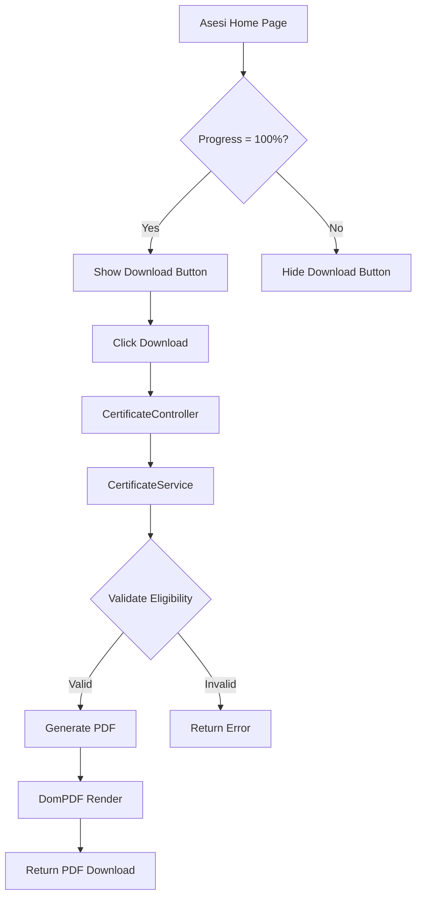

# Design Document: Certificate Generation

## Overview

Fitur ini memungkinkan asesi yang telah menyelesaikan seluruh proses asesmen (progress 100%) untuk mengunduh sertifikat kompetensi dalam format PDF. Sistem akan menggunakan library DomPDF untuk generate PDF dari template Blade dengan desain profesional menggunakan font Poppins dalam orientasi landscape A4.

## Architecture



## Components and Interfaces

### 1. CertificateController

Controller untuk menangani request generate sertifikat.

```php
class CertificateController extends Controller
{
    public function download(): Response
    // Validates user, checks progress, generates PDF
    
    public function preview(): View
    // Shows certificate preview (optional)
}
```

### 2. CertificateService

Service untuk logic generate sertifikat.

```php
class CertificateService
{
    public function isEligibleForCertificate(Asesi $asesi): bool
    // Checks if asesi progress is 100%
    
    public function generateCertificate(Asesi $asesi): string
    // Generates PDF content
    
    public function getCertificateData(Asesi $asesi): array
    // Prepares data for certificate template
}
```

### 3. Certificate Blade Template

Template untuk render sertifikat dengan:
- Font Poppins (Google Fonts)
- A4 Landscape orientation
- LSP UGM header/logo
- Nama asesi, tanggal, skema
- Status "KOMPETEN"
- Area tanda tangan

## Data Models

### Certificate Data Structure

```php
[
    'nama_asesi' => string,      // Nama lengkap asesi
    'tanggal' => string,         // Format: "21 Desember 2025"
    'nama_skema' => string,      // Nama skema sertifikasi
    'nomor_skema' => string,     // Nomor skema
    'nomor_sertifikat' => string, // Generated certificate number
    'status' => 'KOMPETEN',      // Status kompetensi
]
```

### Existing Models Used

- **Asesi**: Contains asesi personal data and progress relation
- **ProgresAsesmen**: Contains progress calculation method
- **Skema**: Contains skema information

## Correctness Properties

*A property is a characteristic or behavior that should hold true across all valid executions of a system-essentially, a formal statement about what the system should do. Properties serve as the bridge between human-readable specifications and machine-verifiable correctness guarantees.*

### Property 1: Certificate button visibility matches progress state
*For any* asesi, the certificate download button is visible if and only if the asesi's progress percentage equals 100%
**Validates: Requirements 1.1, 1.2**

### Property 2: Certificate contains asesi name
*For any* asesi with 100% progress, the generated certificate PDF content contains the asesi's full name
**Validates: Requirements 2.2**

### Property 3: Certificate contains skema name
*For any* asesi with 100% progress, the generated certificate PDF content contains the skema name that the asesi completed
**Validates: Requirements 2.4**

### Property 4: Certificate contains KOMPETEN text
*For any* generated certificate, the PDF content contains the text "KOMPETEN"
**Validates: Requirements 2.6**

### Property 5: Progress validation rejects non-100% progress
*For any* asesi with progress less than 100%, attempting to generate a certificate returns an error
**Validates: Requirements 4.1**

### Property 6: Authorization prevents cross-user access
*For any* authenticated user attempting to generate a certificate for a different asesi, the system rejects the request
**Validates: Requirements 4.2**

## Error Handling

| Error Condition | Response |
|----------------|----------|
| Progress < 100% | 403 Forbidden with message "Anda belum menyelesaikan seluruh proses asesmen" |
| Unauthorized access | 403 Forbidden with message "Anda tidak memiliki akses untuk sertifikat ini" |
| Missing asesi data | 404 Not Found with message "Data asesi tidak ditemukan" |
| Missing skema data | 500 Error with message "Data skema tidak lengkap" |
| PDF generation failure | 500 Error with message "Gagal membuat sertifikat, silakan coba lagi" |

## Testing Strategy

### Unit Testing

- Test `CertificateService::isEligibleForCertificate()` with various progress values
- Test `CertificateService::getCertificateData()` returns correct data structure
- Test date formatting in Indonesian locale

### Property-Based Testing

Library: **Pest PHP with Faker** for generating random test data

Property tests will verify:
1. Button visibility correlates with progress state
2. Certificate content includes required fields for any valid asesi
3. Authorization rules are enforced for all user combinations
4. Progress validation rejects all non-100% values

Each property-based test will be configured to run a minimum of 100 iterations.

Format tag: **Feature: certificate-generation, Property {number}: {property_text}**

### Integration Testing

- Test full flow from button click to PDF download
- Test PDF renders correctly with DomPDF
- Test route protection with middleware
