# Design Document: Dynamic Assessment Flow per Skema

## Overview

Fitur ini mengubah sistem sertifikasi LSP dari alur asesmen statis menjadi dinamis per skema. Setiap skema dapat memiliki konfigurasi perangkat asesmen yang berbeda, dengan konten soal/tugas yang unik. Admin memiliki kontrol penuh, sementara Asesor hanya dapat mengelola skema yang di-assign.

## Architecture

### High-Level Architecture


### Request Flow


## Components and Interfaces

### 1. Models

#### SkemaAssessmentConfig Model
```php
class SkemaAssessmentConfig extends Model
{
    protected $table = 'skema_assessment_config';
    protected $fillable = [
        'id_skema',
        'assessment_type',  // AK01, AK02, AK07, IA01, IA02, IA05, IA07, IA11, MAPA01, MAPA02
        'is_enabled',
        'display_order',
        'config_data'       // JSON for additional settings
    ];
    
    protected $casts = [
        'is_enabled' => 'boolean',
        'config_data' => 'array'
    ];
}
```

#### AsesorSkemaAssignment Model
```php
class AsesorSkemaAssignment extends Model
{
    protected $table = 'asesor_skema_assignment';
    protected $fillable = [
        'id_asesor',
        'id_skema',
        'assigned_by',      // id_user of admin
        'assigned_at'
    ];
}
```

#### AssessmentContent Model
```php
class AssessmentContent extends Model
{
    protected $table = 'assessment_content';
    protected $fillable = [
        'id_skema',
        'assessment_type',
        'content_type',     // multiple_choice, essay, practical_task, checklist
        'content_data',     // JSON containing the actual content
        'created_by',
        'display_order'
    ];
    
    protected $casts = [
        'content_data' => 'array'
    ];
}
```

#### Existing ProgresAsesmen Model (To Be Modified)
The existing `ProgresAsesmen` model will be extended to support dynamic assessment configuration per scheme. Currently it has hardcoded assessment fields, which will be refactored.

```php
// Current structure (to be modified)
class ProgresAsesmen extends Model
{
    protected $table = 'progres_asesmen';
    protected $fillable = [
        'id_asesi',
        'apl01', 'apl02', 'ak01', 'konsultasi_pra_uji',
        'mapa01', 'mapa02', 'pernyataan_ketidak_berpihakan',
        'ak07', 'ia01', 'ia02', 'ia11', 'hasil_asesmen',
        'ak02', 'umpan_balik', 'ak04'
    ];
    
    // New method to check if assessment is enabled for asesi's scheme
    public function isAssessmentEnabledForScheme(string $step): bool;
    
    // New method to get only enabled assessments progress
    public function getEnabledAssessmentsProgress(): array;
}
```

#### Existing ProgressTrackingService (To Be Modified)
The existing `ProgressTrackingService` will be extended to integrate with scheme configuration.

```php
// Extended methods for ProgressTrackingService
class ProgressTrackingService
{
    // Existing methods remain...
    
    // New method: Get progress only for enabled assessments
    public function getEnabledProgressData(string $idAsesi): ?array;
    
    // New method: Calculate progress based on enabled assessments only
    public function calculateSchemeBasedProgress(string $idAsesi): array;
    
    // New method: Check if step is enabled for asesi's scheme
    public function isStepEnabledForAsesi(string $idAsesi, string $step): bool;
}
```

### 2. Services

#### Integration with Existing Services

The system already has `ProgressTrackingService` which will be extended to work with dynamic assessment configuration. The key integration points are:


#### SkemaConfigService
```php
interface SkemaConfigServiceInterface
{
    public function getEnabledAssessments(string $idSkema): Collection;
    public function updateAssessmentConfig(string $idSkema, array $config): bool;
    public function getDefaultConfig(): array;
    public function applyTemplate(string $idSkema, string $templateId): bool;
    public function isAssessmentEnabled(string $idSkema, string $assessmentType): bool;
}
```

#### AccessControlService
```php
interface AccessControlServiceInterface
{
    public function canManageSkema(string $userId, string $idSkema): bool;
    public function getAssignedSkemas(string $idAsesor): Collection;
    public function assignSkemaToAsesor(string $idSkema, string $idAsesor, string $assignedBy): bool;
    public function revokeSkemaFromAsesor(string $idSkema, string $idAsesor): bool;
}
```

#### AssessmentContentService
```php
interface AssessmentContentServiceInterface
{
    public function getContentBySkema(string $idSkema, string $assessmentType): Collection;
    public function createContent(array $data): AssessmentContent;
    public function updateContent(int $contentId, array $data): bool;
    public function deleteContent(int $contentId): bool;
    public function duplicateContentToSkema(string $sourceSkema, string $targetSkema): bool;
}
```

### 3. Controllers

#### SkemaAssessmentConfigController
- `GET /admin/skema/{id}/assessment-config` - Get assessment configuration
- `PUT /admin/skema/{id}/assessment-config` - Update assessment configuration
- `POST /admin/skema/{id}/apply-template` - Apply template to scheme

#### AsesorSkemaAssignmentController
- `GET /admin/asesor/{id}/assignments` - Get asesor's assigned schemes
- `POST /admin/asesor/{id}/assign-skema` - Assign scheme to asesor
- `DELETE /admin/asesor/{id}/revoke-skema/{skemaId}` - Revoke scheme from asesor

#### DynamicContentController
- `GET /assessment-content/{skemaId}/{type}` - Get content for scheme and type
- `POST /assessment-content` - Create new content
- `PUT /assessment-content/{id}` - Update content
- `DELETE /assessment-content/{id}` - Delete content

## Data Models

### Database Schema

```mermaid
erDiagram
    skema ||--o{ skema_assessment_config : has
    skema ||--o{ asesor_skema_assignment : has
    skema ||--o{ assessment_content : has
    skema ||--o{ asesi : has
    asesor ||--o{ asesor_skema_assignment : has
    asesi ||--|| progres_asesmen : has
    users ||--o{ asesor_skema_assignment : assigns
    
    skema {
        string id_skema PK
        string nomor_skema
        string nama_skema
        int id_bidang_kompetensi
    }
    
    skema_assessment_config {
        int id PK
        string id_skema FK
        string assessment_type
        boolean is_enabled
        int display_order
        json config_data
        timestamp created_at
        timestamp updated_at
    }
    
    asesor_skema_assignment {
        int id PK
        string id_asesor FK
        string id_skema FK
        string assigned_by FK
        timestamp assigned_at
        timestamp created_at
        timestamp updated_at
    }
    
    assessment_content {
        int id PK
        string id_skema FK
        string assessment_type
        string content_type
        json content_data
        string created_by FK
        int display_order
        timestamp created_at
        timestamp updated_at
    }
    
    progres_asesmen {
        int id_progres_asesmen PK
        string id_asesi FK
        json apl01
        json apl02
        json ak01
        json konsultasi_pra_uji
        json mapa01
        json mapa02
        json pernyataan_ketidak_berpihakan
        json ak07
        json ia01
        json ia02
        json ia11
        json hasil_asesmen
        json ak02
        json umpan_balik
        json ak04
        timestamp created_at
        timestamp updated_at
    }
    
    asesi {
        string id_asesi PK
        string nama_asesi
        string id_skema FK
        string id_user FK
    }
```



### Existing Tables to Leverage
- `progres_asesmen` - Already tracks assessment progress per asesi with JSON fields for each assessment type
- `asesi` - Links to skema via `id_skema`
- `skema` - Contains scheme information

### New Tables Required
- `skema_assessment_config` - Stores which assessments are enabled per scheme
- `asesor_skema_assignment` - Stores asesor-scheme assignments
- `assessment_content` - Stores dynamic content (questions, tasks) per scheme

### Assessment Types Enum
```php
class AssessmentType
{
    // APL - Always Required
    const APL01 = 'APL01';
    const APL02 = 'APL02';
    
    // AK - Configurable
    const AK01 = 'AK01';
    const AK02 = 'AK02';
    const AK04 = 'AK04';
    const AK07 = 'AK07';
    
    // IA - Configurable
    const IA01 = 'IA01';
    const IA02 = 'IA02';
    const IA05 = 'IA05';
    const IA07 = 'IA07';
    const IA11 = 'IA11';
    
    // MAPA - Configurable
    const MAPA01 = 'MAPA01';
    const MAPA02 = 'MAPA02';
    
    // Others
    const KONSUL_PRA_UJI = 'KONSUL_PRA_UJI';
    const KETIDAKBERPIHAKAN = 'KETIDAKBERPIHAKAN';
    const TUGAS_PESERTA = 'TUGAS_PESERTA';
    
    public static function getMandatoryTypes(): array
    {
        return [self::APL01, self::APL02];
    }
    
    public static function getConfigurableTypes(): array
    {
        return [
            self::AK01, self::AK02, self::AK04, self::AK07,
            self::IA01, self::IA02, self::IA05, self::IA07, self::IA11,
            self::MAPA01, self::MAPA02,
            self::KONSUL_PRA_UJI, self::KETIDAKBERPIHAKAN, self::TUGAS_PESERTA
        ];
    }
}
```

### Content Type Enum
```php
class ContentType
{
    const MULTIPLE_CHOICE = 'multiple_choice';
    const ESSAY = 'essay';
    const PRACTICAL_TASK = 'practical_task';
    const CHECKLIST = 'checklist';
    const DOCUMENT_UPLOAD = 'document_upload';
    const OBSERVATION = 'observation';
}
```

## Correctness Properties

*A property is a characteristic or behavior that should hold true across all valid executions of a system-essentially, a formal statement about what the system should do. Properties serve as the bridge between human-readable specifications and machine-verifiable correctness guarantees.*

### Property 1: APL Tools Mandatory Invariant
*For any* scheme and any configuration update operation, APL tools (APL01, APL02) SHALL remain enabled and cannot be disabled.
**Validates: Requirements 1.3, 2.4**

### Property 2: Assessment Configuration Persistence
*For any* scheme and any assessment type, toggling the enabled state SHALL persist correctly to the database and be retrievable.
**Validates: Requirements 1.2, 2.3**

### Property 3: Asesor Scheme Access Control
*For any* asesor and any scheme, the asesor SHALL only have access to schemes that are explicitly assigned to them.
**Validates: Requirements 2.1, 2.2**

### Property 4: Assignment Creates Access
*For any* admin, asesor, and scheme, creating an assignment SHALL grant the asesor access to that scheme, and revoking SHALL deny access.
**Validates: Requirements 3.2, 3.3**

### Property 5: Content-Scheme Association
*For any* assessment content created for a scheme, the content SHALL be associated with that specific scheme and retrievable only when querying that scheme.
**Validates: Requirements 4.1, 4.2, 4.3**

### Property 6: Content Edit Preserves Association
*For any* assessment content, editing the content SHALL not change its scheme association.
**Validates: Requirements 4.4**

### Property 7: Asesi Sees Only Enabled Assessments
*For any* asesi with a scheme, the dashboard SHALL display only assessment tools that are enabled for their scheme.
**Validates: Requirements 5.1, 5.3**

### Property 8: Asesi Content Matches Scheme
*For any* asesi accessing an assessment tool, the loaded content SHALL be specific to their scheme.
**Validates: Requirements 5.2**

### Property 9: Sidebar Reflects Enabled Tools
*For any* scheme context selection, the sidebar navigation SHALL display exactly the assessment tools that are enabled for that scheme, plus mandatory APL tools.
**Validates: Requirements 6.1, 6.2, 6.3, 6.4**

### Property 10: Default Configuration on New Scheme
*For any* newly created scheme, the system SHALL apply a default assessment tool configuration with APL tools enabled.
**Validates: Requirements 7.1**

### Property 11: Template Application Copies Configuration
*For any* template applied to a scheme, the scheme's configuration SHALL match the template's configuration after application.
**Validates: Requirements 7.3**

### Property 12: Template Isolation
*For any* template modification, schemes that previously used the template SHALL retain their original configuration unchanged.
**Validates: Requirements 7.4**

### Property 13: Progress Record Creation
*For any* asesi starting an assessment, the system SHALL create a progress record for that asesi-scheme-assessment combination.
**Validates: Requirements 8.1**

### Property 14: Progress Completion Update
*For any* asesi completing an assessment, the system SHALL update the progress record with completion status and timestamp.
**Validates: Requirements 8.2**

### Property 15: Historical Progress Retention
*For any* assessment tool disabled after an asesi has completed it, the historical completion data SHALL be retained.
**Validates: Requirements 8.4**

## Error Handling

### Validation Errors
- **Invalid Assessment Type**: Return 400 Bad Request with message indicating valid assessment types
- **APL Disable Attempt**: Return 422 Unprocessable Entity with message "APL tools cannot be disabled"
- **Missing Required Fields**: Return 400 Bad Request with field-specific validation messages

### Authorization Errors
- **Unauthorized Scheme Access**: Return 403 Forbidden with message "You do not have access to this scheme"
- **Admin-Only Operation**: Return 403 Forbidden with message "This operation requires admin privileges"

### Not Found Errors
- **Scheme Not Found**: Return 404 Not Found with message "Scheme not found"
- **Content Not Found**: Return 404 Not Found with message "Assessment content not found"
- **Assignment Not Found**: Return 404 Not Found with message "Assignment not found"

### Database Errors
- **Duplicate Assignment**: Return 409 Conflict with message "Asesor is already assigned to this scheme"
- **Foreign Key Violation**: Return 400 Bad Request with appropriate message

## Testing Strategy

### Unit Testing
Unit tests will verify specific examples and edge cases:
- Test APL tools cannot be disabled
- Test asesor can only access assigned schemes
- Test content is correctly associated with schemes
- Test progress records are created and updated correctly

### Property-Based Testing
Using **Pest PHP with Faker** for property-based testing:

```php
// Example property test structure
it('maintains APL tools as mandatory for any scheme configuration', function () {
    // Generate random scheme and configuration
    $scheme = Skema::factory()->create();
    $config = generateRandomConfig();
    
    // Attempt to disable APL tools
    $config['APL01'] = false;
    $config['APL02'] = false;
    
    // Update configuration
    $service = new SkemaConfigService();
    $service->updateAssessmentConfig($scheme->id_skema, $config);
    
    // Verify APL tools remain enabled
    $savedConfig = $service->getEnabledAssessments($scheme->id_skema);
    expect($savedConfig)->toContain('APL01');
    expect($savedConfig)->toContain('APL02');
})->repeat(100);
```

### Integration Testing
- Test complete flow from admin configuration to asesi dashboard display
- Test asesor assignment and subsequent access control
- Test content creation and retrieval across different schemes

### Test Coverage Requirements
- Minimum 80% code coverage for services
- 100% coverage for access control logic
- All correctness properties must have corresponding property-based tests

## Integration with Existing Code

### Files to Modify

1. **app/Models/ProgresAsesmen.php**
   - Add method `isAssessmentEnabledForScheme()`
   - Add method `getEnabledAssessmentsProgress()`
   - Modify `calculateProgress()` to consider enabled assessments only

2. **app/Services/ProgressTrackingService.php**
   - Add method `getEnabledProgressData()`
   - Add method `calculateSchemeBasedProgress()`
   - Add method `isStepEnabledForAsesi()`
   - Inject `SkemaConfigService` dependency

3. **app/Models/Skema.php**
   - Add relationship `assessmentConfig()`
   - Add relationship `asesorAssignments()`
   - Add method `getEnabledAssessments()`

4. **app/Models/Asesor.php**
   - Add relationship `skemaAssignments()`
   - Add method `getAssignedSkemas()`
   - Add method `canAccessSkema()`

5. **resources/views/home/home-asesor/partials/sidebar.blade.php**
   - Make sidebar dynamic based on scheme configuration
   - Add scheme context selector
   - Filter menu items based on enabled assessments

### New Files to Create

1. **app/Models/SkemaAssessmentConfig.php** - New model
2. **app/Models/AsesorSkemaAssignment.php** - New model
3. **app/Models/AssessmentContent.php** - New model
4. **app/Services/SkemaConfigService.php** - New service
5. **app/Services/AccessControlService.php** - New service
6. **app/Services/AssessmentContentService.php** - New service
7. **app/Http/Controllers/Admin/SkemaAssessmentConfigController.php** - New controller
8. **app/Http/Controllers/Admin/AsesorSkemaAssignmentController.php** - New controller
9. **database/migrations/xxxx_create_skema_assessment_config_table.php** - New migration
10. **database/migrations/xxxx_create_asesor_skema_assignment_table.php** - New migration
11. **database/migrations/xxxx_create_assessment_content_table.php** - New migration

### Backward Compatibility

The system must maintain backward compatibility:
- Existing `progres_asesmen` data remains valid
- Schemes without explicit configuration default to all assessments enabled
- Existing asesi progress is preserved when assessment configuration changes
