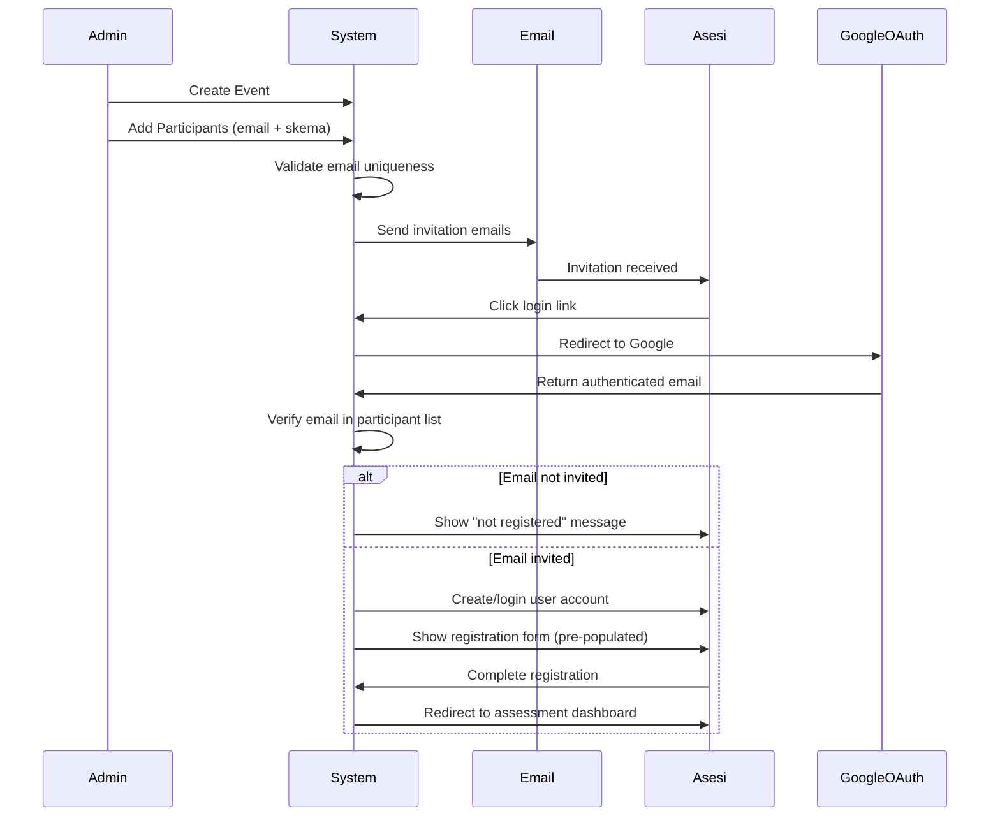

# Design Document: Event-Based Asesi Invitation System

## Overview

This design document specifies the architecture and implementation details for the Event-Based Asesi Invitation System. The system transforms the current open registration model into an admin-controlled invitation system where administrators manage event participants, send email invitations, and control access to certification assessments.

The system enforces strict access control: only users invited by administrators can register and participate in certification events. Each email address can only be registered for one event across the entire system, preventing duplicate registrations and ensuring data integrity.

## Architecture

### System Flow



### Layered Architecture

The system follows Laravel's MVC architecture with additional service layers:

1. **Presentation Layer**: Blade views for admin and asesi interfaces
2. **Controller Layer**: HTTP controllers handling requests and responses
3. **Service Layer**: Business logic for participant management, email sending, and access control
4. **Model Layer**: Eloquent models representing database entities
5. **Data Layer**: MySQL database with migrations

## Components and Interfaces

### Database Schema

#### New Table: event_participants

```php
Schema::create('event_participants', function (Blueprint $table) {
    $table->id();
    $table->string('id_event');
    $table->string('id_skema');
    $table->string('email')->index();
    $table->enum('invitation_status', ['pending', 'sent', 'registered'])->default('pending');
    $table->timestamp('invitation_sent_at')->nullable();
    $table->timestamp('registered_at')->nullable();
    $table->timestamps();
    
    $table->foreign('id_event')->references('id_event')->on('event')->onDelete('cascade');
    $table->foreign('id_skema')->references('id_skema')->on('skema')->onDelete('cascade');
    
    // Unique constraint: one email per event across entire system
    $table->unique('email', 'unique_email_per_system');
    
    // Composite index for queries
    $table->index(['id_event', 'id_skema']);
});
```

#### Modified Table: event

```php
Schema::table('event', function (Blueprint $table) {
    $table->string('surat_penetapan_path')->nullable()->after('tahun_pelaksanaan');
});
```

#### Modified Table: users

```php
// Already has gauth_id and gauth_type columns
// No changes needed
```

### Models

#### EventParticipant Model

```php
class EventParticipant extends Model
{
    protected $fillable = [
        'id_event',
        'id_skema',
        'email',
        'invitation_status',
        'invitation_sent_at',
        'registered_at',
    ];

    protected $casts = [
        'invitation_sent_at' => 'datetime',
        'registered_at' => 'datetime',
    ];

    public function event(): BelongsTo
    {
        return $this->belongsTo(Event::class, 'id_event', 'id_event');
    }

    public function skema(): BelongsTo
    {
        return $this->belongsTo(Skema::class, 'id_skema', 'id_skema');
    }

    public function user(): BelongsTo
    {
        return $this->belongsTo(User::class, 'email', 'email');
    }

    public function scopeForEvent($query, string $eventId)
    {
        return $query->where('id_event', $eventId);
    }

    public function scopeForSkema($query, string $skemaId)
    {
        return $query->where('id_skema', $skemaId);
    }

    public function scopeRegistered($query)
    {
        return $query->where('invitation_status', 'registered');
    }

    public function scopePending($query)
    {
        return $query->whereIn('invitation_status', ['pending', 'sent']);
    }
}
```

#### Event Model (Modified)

```php
class Event extends Model
{
    // Add to $fillable
    protected $fillable = [
        // ... existing fields
        'surat_penetapan_path',
    ];

    public function participants(): HasMany
    {
        return $this->hasMany(EventParticipant::class, 'id_event', 'id_event');
    }

    public function participantsBySkema()
    {
        return $this->participants()->with('skema')->get()->groupBy('id_skema');
    }

    public function getParticipantCount(): int
    {
        return $this->participants()->count();
    }

    public function getRegisteredCount(): int
    {
        return $this->participants()->registered()->count();
    }
}
```

### Services

#### ParticipantManagementService

Handles all participant-related business logic.

```php
class ParticipantManagementService
{
    public function __construct(
        private EmailInvitationService $emailService
    ) {}

    /**
     * Add a single participant to an event
     * 
     * @throws DuplicateEmailException if email already exists
     */
    public function addParticipant(
        string $eventId,
        string $skemaId,
        string $email
    ): EventParticipant {
        // Validate email format
        if (!filter_var($email, FILTER_VALIDATE_EMAIL)) {
            throw new InvalidEmailException("Invalid email format: {$email}");
        }

        // Check if email already exists in system
        if ($this->emailExists($email)) {
            throw new DuplicateEmailException("Email {$email} is already registered in another event");
        }

        // Create participant record
        $participant = EventParticipant::create([
            'id_event' => $eventId,
            'id_skema' => $skemaId,
            'email' => strtolower($email),
            'invitation_status' => 'pending',
        ]);

        // Send invitation email
        $this->emailService->sendInvitation($participant);

        return $participant;
    }

    /**
     * Add multiple participants via bulk input
     * 
     * @param array $emails Array of email addresses
     * @throws DuplicateEmailException if any email already exists
     */
    public function addBulkParticipants(
        string $eventId,
        string $skemaId,
        array $emails
    ): array {
        $emails = array_map('strtolower', array_map('trim', $emails));
        $emails = array_unique($emails);

        // Validate all emails first
        $invalidEmails = [];
        foreach ($emails as $email) {
            if (!filter_var($email, FILTER_VALIDATE_EMAIL)) {
                $invalidEmails[] = $email;
            }
        }

        if (!empty($invalidEmails)) {
            throw new InvalidEmailException("Invalid email formats: " . implode(', ', $invalidEmails));
        }

        // Check for duplicates in system
        $duplicates = $this->findDuplicateEmails($emails);
        if (!empty($duplicates)) {
            throw new DuplicateEmailException("Emails already registered: " . implode(', ', $duplicates));
        }

        // Check for duplicates within the batch
        $batchDuplicates = $this->findBatchDuplicates($emails);
        if (!empty($batchDuplicates)) {
            throw new DuplicateEmailException("Duplicate emails in batch: " . implode(', ', $batchDuplicates));
        }

        // Create all participants
        $participants = [];
        DB::transaction(function () use ($eventId, $skemaId, $emails, &$participants) {
            foreach ($emails as $email) {
                $participant = EventParticipant::create([
                    'id_event' => $eventId,
                    'id_skema' => $skemaId,
                    'email' => $email,
                    'invitation_status' => 'pending',
                ]);
                $participants[] = $participant;
            }

            // Send all invitations
            foreach ($participants as $participant) {
                $this->emailService->sendInvitation($participant);
            }
        });

        return $participants;
    }

    /**
     * Update participant's skema
     */
    public function updateParticipantSkema(
        int $participantId,
        string $newSkemaId
    ): EventParticipant {
        $participant = EventParticipant::findOrFail($participantId);
        $participant->update(['id_skema' => $newSkemaId]);

        // Send updated invitation
        $this->emailService->sendUpdatedInvitation($participant);

        return $participant;
    }

    /**
     * Remove participant and revoke access
     */
    public function removeParticipant(int $participantId): void
    {
        $participant = EventParticipant::findOrFail($participantId);
        
        // Log the removal for audit
        Log::info('Participant removed', [
            'participant_id' => $participantId,
            'email' => $participant->email,
            'event_id' => $participant->id_event,
            'removed_by' => auth()->id(),
        ]);

        $participant->delete();
    }

    /**
     * Check if email exists in any event
     */
    public function emailExists(string $email): bool
    {
        return EventParticipant::where('email', strtolower($email))->exists();
    }

    /**
     * Find duplicate emails from array
     */
    private function findDuplicateEmails(array $emails): array
    {
        return EventParticipant::whereIn('email', $emails)->pluck('email')->toArray();
    }

    /**
     * Find duplicates within the batch itself
     */
    private function findBatchDuplicates(array $emails): array
    {
        $counts = array_count_values($emails);
        return array_keys(array_filter($counts, fn($count) => $count > 1));
    }

    /**
     * Get participants grouped by skema for an event
     */
    public function getParticipantsBySkema(string $eventId): Collection
    {
        return EventParticipant::with(['skema', 'user'])
            ->where('id_event', $eventId)
            ->get()
            ->groupBy('id_skema');
    }
}
```

#### EmailInvitationService

Handles email sending logic.

```php
class EmailInvitationService
{
    /**
     * Send invitation email to participant
     */
    public function sendInvitation(EventParticipant $participant): void
    {
        $event = $participant->event;
        $skema = $participant->skema;

        Mail::to($participant->email)->send(
            new AsesiInvitationMail($participant, $event, $skema)
        );

        $participant->update([
            'invitation_status' => 'sent',
            'invitation_sent_at' => now(),
        ]);
    }

    /**
     * Send updated invitation when skema changes
     */
    public function sendUpdatedInvitation(EventParticipant $participant): void
    {
        $event = $participant->event;
        $skema = $participant->skema;

        Mail::to($participant->email)->send(
            new AsesiInvitationUpdatedMail($participant, $event, $skema)
        );

        $participant->update([
            'invitation_sent_at' => now(),
        ]);
    }
}
```

#### AccessControlService

Handles authentication and authorization logic.

```php
class AccessControlService
{
    /**
     * Check if user email is invited to any event
     */
    public function isEmailInvited(string $email): bool
    {
        return EventParticipant::where('email', strtolower($email))->exists();
    }

    /**
     * Get participant record for email
     */
    public function getParticipantByEmail(string $email): ?EventParticipant
    {
        return EventParticipant::with(['event', 'skema'])
            ->where('email', strtolower($email))
            ->first();
    }

    /**
     * Mark participant as registered
     */
    public function markAsRegistered(string $email): void
    {
        EventParticipant::where('email', strtolower($email))
            ->update([
                'invitation_status' => 'registered',
                'registered_at' => now(),
            ]);
    }

    /**
     * Check if user has access to assessment
     */
    public function canAccessAssessment(User $user): bool
    {
        return EventParticipant::where('email', strtolower($user->email))
            ->where('invitation_status', 'registered')
            ->exists();
    }
}
```

### Controllers

#### Admin/EventParticipantController

```php
class EventParticipantController extends Controller
{
    public function __construct(
        private ParticipantManagementService $participantService
    ) {}

    /**
     * Show participant management page for event
     */
    public function index(string $eventId)
    {
        $event = Event::with('tuk')->findOrFail($eventId);
        $participantsBySkema = $this->participantService->getParticipantsBySkema($eventId);
        $skemas = Skema::all();

        return view('home.home-admin.event-participants', compact(
            'event',
            'participantsBySkema',
            'skemas'
        ));
    }

    /**
     * Add single participant
     */
    public function store(Request $request, string $eventId)
    {
        $validated = $request->validate([
            'email' => 'required|email',
            'id_skema' => 'required|exists:skema,id_skema',
        ]);

        try {
            $participant = $this->participantService->addParticipant(
                $eventId,
                $validated['id_skema'],
                $validated['email']
            );

            return redirect()->back()->with('success', 'Participant added and invitation sent');
        } catch (DuplicateEmailException $e) {
            return redirect()->back()->withErrors(['email' => $e->getMessage()]);
        } catch (InvalidEmailException $e) {
            return redirect()->back()->withErrors(['email' => $e->getMessage()]);
        }
    }

    /**
     * Add bulk participants
     */
    public function storeBulk(Request $request, string $eventId)
    {
        $validated = $request->validate([
            'emails' => 'required|string',
            'id_skema' => 'required|exists:skema,id_skema',
        ]);

        // Parse emails (comma or space separated)
        $emails = preg_split('/[\s,]+/', $validated['emails'], -1, PREG_SPLIT_NO_EMPTY);

        try {
            $participants = $this->participantService->addBulkParticipants(
                $eventId,
                $validated['id_skema'],
                $emails
            );

            return redirect()->back()->with('success', count($participants) . ' participants added and invitations sent');
        } catch (DuplicateEmailException $e) {
            return redirect()->back()->withErrors(['emails' => $e->getMessage()]);
        } catch (InvalidEmailException $e) {
            return redirect()->back()->withErrors(['emails' => $e->getMessage()]);
        }
    }

    /**
     * Update participant skema
     */
    public function update(Request $request, string $eventId, int $participantId)
    {
        $validated = $request->validate([
            'id_skema' => 'required|exists:skema,id_skema',
        ]);

        try {
            $this->participantService->updateParticipantSkema(
                $participantId,
                $validated['id_skema']
            );

            return redirect()->back()->with('success', 'Participant updated and new invitation sent');
        } catch (\Exception $e) {
            return redirect()->back()->withErrors(['error' => $e->getMessage()]);
        }
    }

    /**
     * Remove participant
     */
    public function destroy(string $eventId, int $participantId)
    {
        try {
            $this->participantService->removeParticipant($participantId);
            return redirect()->back()->with('success', 'Participant removed and access revoked');
        } catch (\Exception $e) {
            return redirect()->back()->withErrors(['error' => $e->getMessage()]);
        }
    }
}
```

#### Admin/EventController (Modified)

```php
class EventController extends Controller
{
    /**
     * Store surat penetapan file
     */
    public function uploadSuratPenetapan(Request $request, string $eventId)
    {
        $validated = $request->validate([
            'surat_penetapan' => 'required|file|mimes:pdf,jpg,jpeg,png|max:5120', // 5MB max
        ]);

        $event = Event::findOrFail($eventId);

        // Delete old file if exists
        if ($event->surat_penetapan_path && Storage::exists($event->surat_penetapan_path)) {
            Storage::delete($event->surat_penetapan_path);
        }

        // Store new file
        $path = $request->file('surat_penetapan')->store('surat-penetapan', 'public');

        $event->update(['surat_penetapan_path' => $path]);

        return redirect()->back()->with('success', 'Surat Penetapan uploaded successfully');
    }

    /**
     * Download surat penetapan
     */
    public function downloadSuratPenetapan(string $eventId)
    {
        $event = Event::findOrFail($eventId);

        if (!$event->surat_penetapan_path || !Storage::exists($event->surat_penetapan_path)) {
            abort(404, 'File not found');
        }

        return Storage::download($event->surat_penetapan_path);
    }
}
```

#### Auth/GoogleOAuthController

```php
class GoogleOAuthController extends Controller
{
    public function __construct(
        private AccessControlService $accessControl
    ) {}

    /**
     * Redirect to Google OAuth
     */
    public function redirectToGoogle()
    {
        return Socialite::driver('google')->redirect();
    }

    /**
     * Handle Google OAuth callback
     */
    public function handleGoogleCallback()
    {
        try {
            $googleUser = Socialite::driver('google')->user();
            $email = strtolower($googleUser->getEmail());

            // Check if email is invited
            if (!$this->accessControl->isEmailInvited($email)) {
                return redirect()->route('login')->with('error', 
                    'Your email is not registered for any event. Please contact the administrator.');
            }

            // Get participant details
            $participant = $this->accessControl->getParticipantByEmail($email);

            // Find or create user
            $user = User::where('email', $email)->first();

            if (!$user) {
                $user = User::create([
                    'name' => $googleUser->getName(),
                    'email' => $email,
                    'gauth_id' => $googleUser->getId(),
                    'gauth_type' => 'google',
                    'level' => 'asesi',
                    'password' => bcrypt(Str::random(32)), // Random password
                ]);
            } else {
                // Update Google auth info if needed
                $user->update([
                    'gauth_id' => $googleUser->getId(),
                    'gauth_type' => 'google',
                ]);
            }

            // Login user
            Auth::login($user);

            // Check if already registered
            if ($participant->invitation_status === 'registered') {
                return redirect()->route('asesi.dashboard');
            }

            // Redirect to registration flow with pre-populated data
            session([
                'registration_event_id' => $participant->id_event,
                'registration_skema_id' => $participant->id_skema,
            ]);

            return redirect()->route('asesi.registration.start');

        } catch (\Exception $e) {
            Log::error('Google OAuth error: ' . $e->getMessage());
            return redirect()->route('login')->with('error', 'Authentication failed. Please try again.');
        }
    }
}
```

#### Asesi/RegistrationController

```php
class RegistrationController extends Controller
{
    public function __construct(
        private AccessControlService $accessControl
    ) {
        $this->middleware('auth');
    }

    /**
     * Show registration start page
     */
    public function start()
    {
        $user = auth()->user();

        // Verify user is invited
        if (!$this->accessControl->isEmailInvited($user->email)) {
            return redirect()->route('login')->with('error', 'You are not registered for any event.');
        }

        $participant = $this->accessControl->getParticipantByEmail($user->email);

        // If already registered, redirect to dashboard
        if ($participant->invitation_status === 'registered') {
            return redirect()->route('asesi.dashboard');
        }

        $event = $participant->event;
        $skema = $participant->skema;

        return view('home.home-asesi.registration.start', compact('event', 'skema', 'user'));
    }

    /**
     * Complete registration and mark as registered
     */
    public function complete(Request $request)
    {
        $user = auth()->user();

        // Mark participant as registered
        $this->accessControl->markAsRegistered($user->email);

        return redirect()->route('asesi.dashboard')->with('success', 'Registration completed successfully');
    }
}
```

### Middleware

#### CheckAsesiInvitation

```php
class CheckAsesiInvitation
{
    public function __construct(
        private AccessControlService $accessControl
    ) {}

    public function handle(Request $request, Closure $next)
    {
        $user = auth()->user();

        if (!$user) {
            return redirect()->route('login');
        }

        // Check if user is invited
        if (!$this->accessControl->isEmailInvited($user->email)) {
            Auth::logout();
            return redirect()->route('login')->with('error', 
                'Your email is not registered for any event. Please contact the administrator.');
        }

        // Check if user has completed registration
        if (!$this->accessControl->canAccessAssessment($user)) {
            return redirect()->route('asesi.registration.start');
        }

        return $next($request);
    }
}
```

### Mail Classes

#### AsesiInvitationMail

```php
class AsesiInvitationMail extends Mailable
{
    public function __construct(
        public EventParticipant $participant,
        public Event $event,
        public Skema $skema
    ) {}

    public function build()
    {
        return $this->subject('Invitation to Certification Event: ' . $this->event->nama_event)
            ->markdown('emails.asesi-invitation')
            ->with([
                'eventName' => $this->event->nama_event,
                'eventDates' => $this->event->rentang_waktu,
                'skemaName' => $this->skema->nama_skema,
                'loginUrl' => route('auth.google'),
            ]);
    }
}
```

## Data Models

### EventParticipant

- **id**: Primary key
- **id_event**: Foreign key to event table
- **id_skema**: Foreign key to skema table
- **email**: Participant email (unique across system)
- **invitation_status**: Enum (pending, sent, registered)
- **invitation_sent_at**: Timestamp when invitation was sent
- **registered_at**: Timestamp when participant completed registration
- **timestamps**: created_at, updated_at

### Event (Modified)

- **surat_penetapan_path**: Path to uploaded surat penetapan file

### User (No changes)

- Already has gauth_id and gauth_type for Google OAuth

## Correctness Properties

*A property is a characteristic or behavior that should hold true across all valid executions of a system—essentially, a formal statement about what the system should do. Properties serve as the bridge between human-readable specifications and machine-verifiable correctness guarantees.*


### Property Reflection

After analyzing all acceptance criteria, several redundant properties were identified:

- **1.3, 1.4, 8.1, 8.2, 13.6** all test email uniqueness across the system → Combine into one comprehensive property
- **1.5 and 12.1** both test participant deletion → Already covered by 1.5
- **3.3 and 9.4** both test email sending on skema change → Already covered by 3.3
- **5.5 and 6.2** both test uninvited user messaging → Already covered by 5.5
- **9.2 and 9.3** both test skema update → Already covered by 9.2
- **2.4 and 13.1** both test email format validation → Combine into one property
- **13.3 and 13.4** both test batch duplicate detection → Already covered by 13.3

The following properties provide unique validation value and will be implemented:

### Correctness Properties

Property 1: Email Global Uniqueness
*For any* email address, if it exists in any Event_Participant record, then attempting to add it to any event (including the same event) should be rejected with a duplicate error.
**Validates: Requirements 1.3, 1.4, 8.1, 8.2, 13.6**

Property 2: Participant Creation
*For any* valid email and skema combination, when an admin adds a participant to an event, an Event_Participant record should be created with the correct email, event, and skema.
**Validates: Requirements 1.2**

Property 3: Participant Deletion
*For any* existing participant, when an admin removes them, the Event_Participant record should be deleted from the database.
**Validates: Requirements 1.5, 12.1**

Property 4: Email Format Validation
*For any* string, the system should accept it as an email only if it contains an @ symbol and follows standard email format rules.
**Validates: Requirements 2.4, 13.1**

Property 5: Bulk Duplicate Detection
*For any* bulk email input, if the batch contains duplicate emails (case-insensitive), the entire operation should be rejected.
**Validates: Requirements 2.5, 2.6, 13.3, 13.4**

Property 6: Bulk Atomic Operation
*For any* bulk email input, if any single email already exists in the system, the entire batch should be rejected and no participants should be created.
**Validates: Requirements 2.6**

Property 7: Bulk Skema Assignment
*For any* bulk email input with a selected skema, all created Event_Participant records should have the same skema assigned.
**Validates: Requirements 2.8**

Property 8: Invitation Email Sending
*For any* newly created participant, an invitation email should be sent to their email address.
**Validates: Requirements 3.1**

Property 9: Bulk Invitation Sending
*For any* bulk participant creation, the number of invitation emails sent should equal the number of participants created.
**Validates: Requirements 3.2**

Property 10: Update Invitation Sending
*For any* participant skema update, an updated invitation email should be sent to the participant's email address.
**Validates: Requirements 3.3, 9.4**

Property 11: No Email on Removal
*For any* participant removal, no email notification should be sent.
**Validates: Requirements 3.4**

Property 12: Invitation Email Content
*For any* invitation email, it should contain the event name, event dates, skema name, and Google OAuth login link.
**Validates: Requirements 3.5, 3.6**

Property 13: File Format Validation
*For any* file upload attempt for Surat_Penetapan, the system should accept only PDF, JPG, and PNG formats and reject all others.
**Validates: Requirements 4.2**

Property 14: File Storage and Association
*For any* valid Surat_Penetapan file upload, the file should be stored and the event's surat_penetapan_path should reference the stored file.
**Validates: Requirements 4.3**

Property 15: File Replacement
*For any* event with an existing Surat_Penetapan, uploading a new file should replace the old file and only one file should exist.
**Validates: Requirements 4.4**

Property 16: Optional File Upload
*For any* event creation, the event should be created successfully even without uploading a Surat_Penetapan file.
**Validates: Requirements 4.5**

Property 17: Email Invitation Check
*For any* email address attempting to log in via Google OAuth, the system should check if it exists in Event_Participant records.
**Validates: Requirements 5.4**

Property 18: Uninvited User Rejection
*For any* email address not in Event_Participant records, attempting to log in should result in a warning message and no user session.
**Validates: Requirements 5.5, 6.2**

Property 19: Invited User Login
*For any* email address in Event_Participant records, logging in via Google OAuth should create or retrieve a user account and establish a session.
**Validates: Requirements 5.6**

Property 20: Registration Access Control
*For any* user attempting to access registration pages, access should be granted only if their email exists in Event_Participant records.
**Validates: Requirements 6.1, 6.3**

Property 21: Authorized Registration Access
*For any* user whose email exists in Event_Participant records, they should be able to access the registration flow for their assigned event and skema.
**Validates: Requirements 6.4**

Property 22: Event Pre-population
*For any* invited asesi accessing the registration flow, the event field should be pre-populated with their assigned event and be immutable.
**Validates: Requirements 7.1, 7.3**

Property 23: Skema Pre-population
*For any* invited asesi accessing the registration flow, the skema field should be pre-populated with their assigned skema and be immutable.
**Validates: Requirements 7.2, 7.3**

Property 24: Google Data Auto-population
*For any* asesi logging in via Google OAuth, their name and email fields should be auto-populated from their Google account data.
**Validates: Requirements 7.6**

Property 25: Registered User Redirect
*For any* asesi who has already completed registration (invitation_status = 'registered'), accessing the registration flow should redirect them to the assessment dashboard.
**Validates: Requirements 7.7**

Property 26: Email Reuse After Removal
*For any* email address, if its Event_Participant record is deleted, the same email should be allowed to be added to a different event.
**Validates: Requirements 8.5**

Property 27: Skema Update
*For any* existing participant, when an admin updates their skema, the Event_Participant record should reflect the new skema.
**Validates: Requirements 9.2, 9.3**

Property 28: Email Immutability in Edit
*For any* participant edit operation, attempting to change the email address should be rejected.
**Validates: Requirements 9.5**

Property 29: Participant Grouping by Skema
*For any* event, retrieving participants should group them by their assigned skema with all participants of the same skema together.
**Validates: Requirements 10.2**

Property 30: Participant Count Accuracy
*For any* event, the displayed total participant count should equal the actual number of Event_Participant records for that event.
**Validates: Requirements 10.5**

Property 31: Access Revocation After Removal
*For any* removed participant, attempting to access the assessment system should be denied with a not-registered message.
**Validates: Requirements 12.2**

Property 32: Session Revocation
*For any* logged-in participant who is removed, their next page load should revoke their session and deny access.
**Validates: Requirements 12.3**

Property 33: Removal Audit Logging
*For any* participant removal, an audit log entry should be created containing the participant email, event, timestamp, and admin who performed the removal.
**Validates: Requirements 12.4**

Property 34: Invalid Email Rejection
*For any* string that does not follow standard email format, submitting it as a participant email should be rejected with a format error message.
**Validates: Requirements 13.2**

Property 35: Case-Insensitive Email Comparison
*For any* two email addresses that differ only in letter casing, they should be treated as identical when checking for duplicates.
**Validates: Requirements 13.5**

## Error Handling

### Validation Errors

1. **DuplicateEmailException**: Thrown when attempting to add an email that already exists in the system
   - HTTP Status: 422 Unprocessable Entity
   - User Message: "Email {email} is already registered in another event"
   - Action: Display error message, keep form data, highlight email field

2. **InvalidEmailException**: Thrown when email format is invalid
   - HTTP Status: 422 Unprocessable Entity
   - User Message: "Invalid email format: {email}"
   - Action: Display error message, highlight invalid emails

3. **BulkOperationException**: Thrown when bulk operation fails
   - HTTP Status: 422 Unprocessable Entity
   - User Message: "Bulk operation failed: {reason}"
   - Action: Display error message with list of problematic emails

### Authentication Errors

1. **UnauthorizedAccessException**: Thrown when uninvited user attempts access
   - HTTP Status: 403 Forbidden
   - User Message: "Your email is not registered for any event. Please contact the administrator."
   - Action: Redirect to login page, display error message

2. **GoogleOAuthException**: Thrown when Google OAuth fails
   - HTTP Status: 500 Internal Server Error
   - User Message: "Authentication failed. Please try again."
   - Action: Log error details, redirect to login page

### File Upload Errors

1. **InvalidFileTypeException**: Thrown when unsupported file type is uploaded
   - HTTP Status: 422 Unprocessable Entity
   - User Message: "Only PDF, JPG, and PNG files are allowed"
   - Action: Display error message, keep form data

2. **FileSizeException**: Thrown when file exceeds size limit
   - HTTP Status: 422 Unprocessable Entity
   - User Message: "File size must not exceed 5MB"
   - Action: Display error message, keep form data

### Database Errors

1. **RecordNotFoundException**: Thrown when participant/event/skema not found
   - HTTP Status: 404 Not Found
   - User Message: "Record not found"
   - Action: Redirect to appropriate page with error message

2. **DatabaseException**: Thrown on database operation failures
   - HTTP Status: 500 Internal Server Error
   - User Message: "An error occurred. Please try again."
   - Action: Log error details, display generic error message

## Testing Strategy

### Dual Testing Approach

The system will be tested using both unit tests and property-based tests:

- **Unit tests**: Verify specific examples, edge cases, and error conditions
- **Property tests**: Verify universal properties across all inputs
- Both approaches are complementary and necessary for comprehensive coverage

### Unit Testing

Unit tests will focus on:

1. **Specific Examples**:
   - Adding a participant with valid email and skema
   - Removing a participant and verifying deletion
   - Uploading a valid Surat_Penetapan file
   - Google OAuth callback with invited email

2. **Edge Cases**:
   - Empty email string
   - Email with special characters
   - Very long email addresses
   - Bulk input with single email
   - File upload at exactly 5MB limit

3. **Error Conditions**:
   - Adding duplicate email
   - Invalid email format
   - Unsupported file type
   - Uninvited user login attempt
   - Accessing registration without invitation

4. **Integration Points**:
   - Google OAuth flow end-to-end
   - Email sending via mail service
   - File storage via filesystem
   - Session management

### Property-Based Testing

Property tests will be implemented using **Pest PHP** with the **pest-plugin-faker** for data generation. Each test will run a minimum of **100 iterations** to ensure comprehensive input coverage.

Property tests will focus on:

1. **Email Uniqueness Properties** (Properties 1, 5, 6, 35):
   - Generate random emails and events
   - Verify global uniqueness constraint
   - Test case-insensitive comparison

2. **CRUD Properties** (Properties 2, 3, 27):
   - Generate random participants
   - Verify creation, update, deletion

3. **Validation Properties** (Properties 4, 13, 34):
   - Generate random strings and files
   - Verify format validation

4. **Email Sending Properties** (Properties 8, 9, 10, 11, 12):
   - Generate random participants
   - Verify email sending behavior

5. **Access Control Properties** (Properties 17, 18, 19, 20, 21, 31, 32):
   - Generate random users (invited and uninvited)
   - Verify access control logic

6. **Data Integrity Properties** (Properties 22, 23, 24, 25, 26, 28, 29, 30, 33):
   - Generate random data
   - Verify data consistency and integrity

### Test Configuration

Each property test must:
- Run minimum 100 iterations
- Include a comment tag: `// Feature: event-based-invitation, Property {number}: {property_text}`
- Use Faker to generate realistic test data
- Assert the property holds for all generated inputs
- Clean up test data after execution

Example property test structure:

```php
// Feature: event-based-invitation, Property 1: Email Global Uniqueness
test('email addresses must be globally unique across all events', function () {
    // Generate random existing participant
    $existingEmail = fake()->email();
    $event1 = Event::factory()->create();
    $skema1 = Skema::factory()->create();
    
    EventParticipant::create([
        'id_event' => $event1->id_event,
        'id_skema' => $skema1->id_skema,
        'email' => $existingEmail,
    ]);

    // Try to add same email to different event
    $event2 = Event::factory()->create();
    $skema2 = Skema::factory()->create();

    expect(fn() => app(ParticipantManagementService::class)->addParticipant(
        $event2->id_event,
        $skema2->id_skema,
        $existingEmail
    ))->toThrow(DuplicateEmailException::class);
})->repeat(100);
```

### Test Coverage Goals

- **Unit Test Coverage**: Minimum 80% code coverage
- **Property Test Coverage**: All 35 correctness properties implemented
- **Integration Test Coverage**: All critical user flows tested end-to-end
- **Edge Case Coverage**: All identified edge cases tested

### Continuous Integration

Tests will run automatically on:
- Every commit to feature branches
- Pull requests to main branch
- Scheduled daily runs on main branch

Failed tests will block merges and trigger notifications to the development team.
