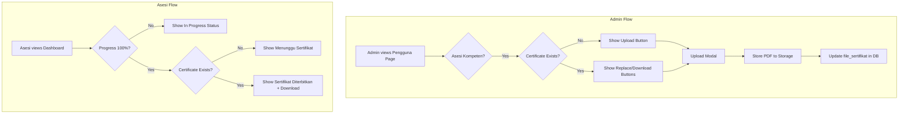

# Design Document

## Overview

This design document describes the implementation of a manual certificate upload system for the LSP UGM certification platform. The system allows administrators to upload PDF certificates for asesi who have completed their assessment (Kompeten status), and enables asesi to download their certificates from their dashboard.

The key changes from the previous auto-generated certificate approach:
1. Certificates are uploaded manually by admin instead of generated
2. The existing `file_sertifikat` field in the `asesi` table stores the uploaded file path
3. Asesi dashboard shows appropriate status based on progress and certificate availability

## Architecture



## Components and Interfaces

### 1. CertificateUploadController (New)

Handles certificate upload operations for admin.

```php
class CertificateUploadController extends Controller
{
    public function upload(Request $request, string $id_asesi): JsonResponse
    public function download(string $id_asesi): BinaryFileResponse|RedirectResponse
    public function delete(string $id_asesi): JsonResponse
}
```

### 2. AsesiController (Modified)

Update the `index()` method to pass certificate status to the view.

```php
// Add to index() method
$hasCertificate = !empty($asesi->file_sertifikat);
$certificateStatus = $this->getCertificateStatus($asesi, $progressPercentage);
```

### 3. PenggunaPageController (Modified)

Add certificate status attribute to asesi data for display in the table.

### 4. Routes

```php
// Admin certificate management
Route::post('admin/asesi/{id}/certificate/upload', [CertificateUploadController::class, 'upload'])
    ->name('admin.asesi.certificate.upload');
Route::get('admin/asesi/{id}/certificate/download', [CertificateUploadController::class, 'download'])
    ->name('admin.asesi.certificate.download');
Route::delete('admin/asesi/{id}/certificate/delete', [CertificateUploadController::class, 'delete'])
    ->name('admin.asesi.certificate.delete');

// Asesi certificate download
Route::get('asesi/certificate/download', [AsesiController::class, 'downloadCertificate'])
    ->name('asesi.certificate.download');
```

## Data Models

### Asesi Model (Existing)

The `file_sertifikat` field already exists in the asesi table:

| Field | Type | Description |
|-------|------|-------------|
| file_sertifikat | string (nullable) | Path to uploaded certificate PDF |

No database migration needed - using existing field.

### File Storage

Certificates stored at: `storage/app/public/certificates/{id_asesi}/certificate.pdf`

## Correctness Properties

*A property is a characteristic or behavior that should hold true across all valid executions of a system-essentially, a formal statement about what the system should do. Properties serve as the bridge between human-readable specifications and machine-verifiable correctness guarantees.*

### Property 1: Certificate Upload/Download Round-Trip

*For any* valid PDF file uploaded for an asesi, downloading that certificate should return the exact same file content.

**Validates: Requirements 1.3, 2.2, 4.2, 5.1**

### Property 2: Invalid File Type Rejection

*For any* file that is not a PDF (e.g., .txt, .jpg, .exe), the upload endpoint should reject the file and return a validation error without modifying the asesi's file_sertifikat field.

**Validates: Requirements 1.4**

### Property 3: Old File Deletion on Replacement

*For any* asesi with an existing certificate, when a new certificate is uploaded, the old file should no longer exist in storage.

**Validates: Requirements 2.3**

### Property 4: Certificate Status Display Logic

*For any* asesi:
- If progress < 100%: status is "Sedang berlangsung"
- If progress >= 100% AND no certificate: status is "Menunggu Sertifikat"  
- If progress >= 100% AND has certificate: status is "Sertifikat Diterbitkan"

**Validates: Requirements 3.1, 3.2, 3.3, 4.3**

### Property 5: Download Button Visibility Based on Certificate

*For any* asesi with a non-empty file_sertifikat field, the download button should be visible/enabled. For any asesi with empty file_sertifikat, the download button should be hidden/disabled.

**Validates: Requirements 1.5, 2.1, 4.1, 5.2**

### Property 6: Upload Button Visibility for Kompeten Asesi

*For any* asesi with Kompeten status (progress >= 100%), the upload/replace certificate button should be visible to admin. For any asesi with progress < 100%, no certificate upload option should be shown.

**Validates: Requirements 1.1, 4.4**

## Error Handling

| Error Scenario | Response |
|----------------|----------|
| Invalid file type | 422 Validation Error with message |
| File too large (>10MB) | 422 Validation Error with message |
| Asesi not found | 404 Not Found |
| Certificate not found | 404 Not Found with "Sertifikat belum siap" |
| Storage write failure | 500 Server Error |
| Unauthorized access | 403 Forbidden |

## Testing Strategy

### Dual Testing Approach

Both unit tests and property-based tests will be implemented:

**Unit Tests:**
- Test upload endpoint with valid PDF
- Test upload endpoint with invalid file types
- Test download endpoint for existing certificate
- Test download endpoint for missing certificate
- Test certificate status calculation

**Property-Based Testing:**

Using Pest PHP with `pestphp/pest-plugin-faker` for property-based testing.

Each property test will:
1. Generate random valid inputs
2. Execute the operation
3. Verify the property holds
4. Run minimum 100 iterations

Property tests will be annotated with:
```php
// **Feature: manual-certificate-upload, Property {number}: {property_text}**
```
